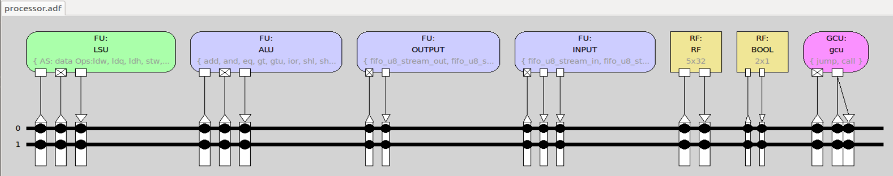

# Basic TTA processor (no custom components)
[`processor.adf`](processor.adf) contains very simple TTA processor that can be used to execute the [FIR program](fir-basic-tta.c).

The processor looks like this:


It is very slow, taking over 17 million cycles to filter about 16k samples

## Compiling
```console
tcecc -O3 -a processor.adf -o fir.tpef fir-basic-tta.c
```

## Simulating
```console
$ cp ../data/input.in INPUT.in
$ ttasim -a processor.adf -p fir.tpef

(ttasim) info proc cycles
17530539
```

[Output](OUTPUT.out) is close to reference output, so it is working properly:
```console
$ typeout OUTPUT.out 
Sum: 2084320

$ typeout ../data/reference.out 
Sum: 2085077
```

Listening to the [`OUTPUT.out` waveform](output.wav) also confirms that the filter works, as the annoying high pitched noise is removed.
A utility program for converting `INPUT.in` and `OUTPUT.out` to proper wav format that can be played with audio player can be found [here](../util/dec2bin/).