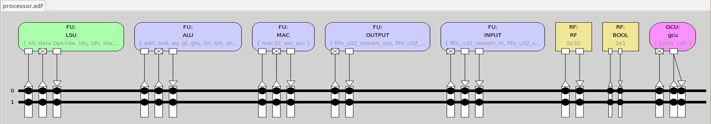
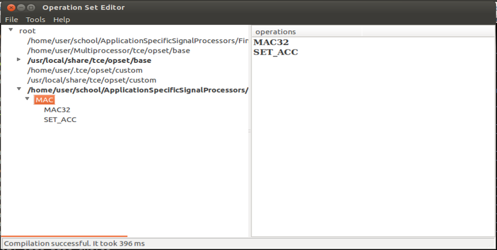
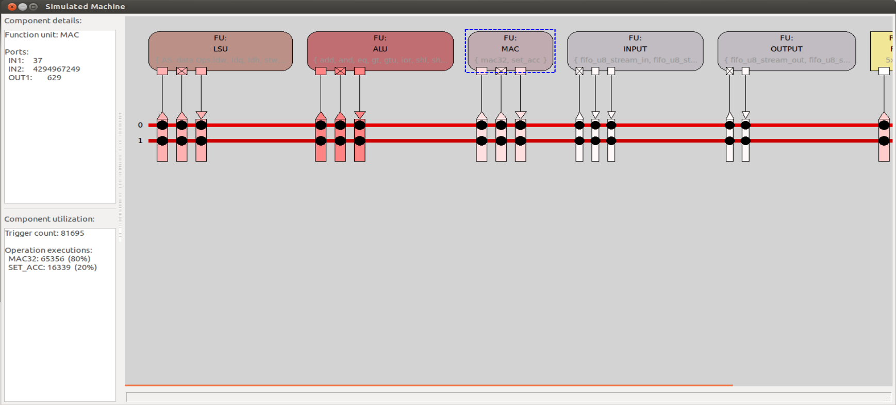

# TTA processor with custom MAC unit
[`processor.adf`](processor.adf) contains a simple TTA processor design with a custom MAC unit, and it looks like this:



## Custom MAC unit
The behaviour of the MAC is defined in [mac.cc](mac.cc) file.

OSED is able to compile it:


The behaviour is quite simple, but it requires using state, so it was a bit trickier than the example in TCE tutorial.

## Calling custom MAC unit from code
The custom MAC instructions will replace the following part of the filtering:
```c
s = K0*buffer[0];
s += K1*buffer[1];
s += K2*buffer[2];
s += K3*buffer[3];
```

and will look like this:
```c
// reset accumulator to 0
_TCE_SET_ACC(0);

// call MAC instruction, we only need the last accumulator value so its ok to overwrite s with each call
_TCE_MAC32(K0, buffer[0], s);
_TCE_MAC32(K1, buffer[1], s);
_TCE_MAC32(K2, buffer[2], s);
_TCE_MAC32(K3, buffer[3], s);
```

## Compiling
```console
tcecc -O3 -a processor.adf -o fir-with-mac.tpef fir-tta-with-mac.c
```

Originally, I had set `acc_set` input to port 1, but had to change it to port 2, so that it can use the same trigger as `mac32` function.

## Simulating
```console
$ ttasim -a processor.adf -p fir-with-mac.tpef

(ttasim) info proc cycles
637388
```
Execution is much faster, and we can see the MAC unit being utilized:

The MAC unit is getting called 5 times per sample as expected, once to reset the accumulator and four times to multiply-and-accumulate the samples & filter coefficients.

Again, typeout confirms that the [output](OUTPUT.out) is as expected:
```console
$ typeout OUTPUT.out 
Sum: 2084320

$ typeout ../data/reference.out 
Sum: 2085077
```

as does listening to the [produced waveform](output.wav).