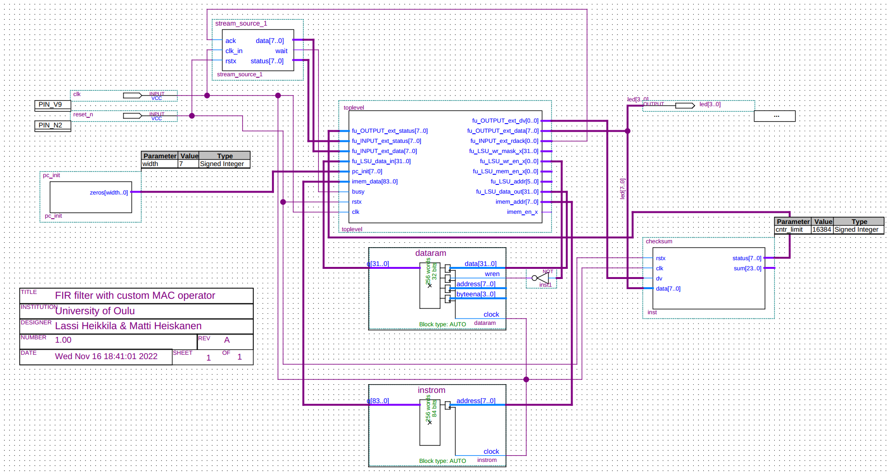
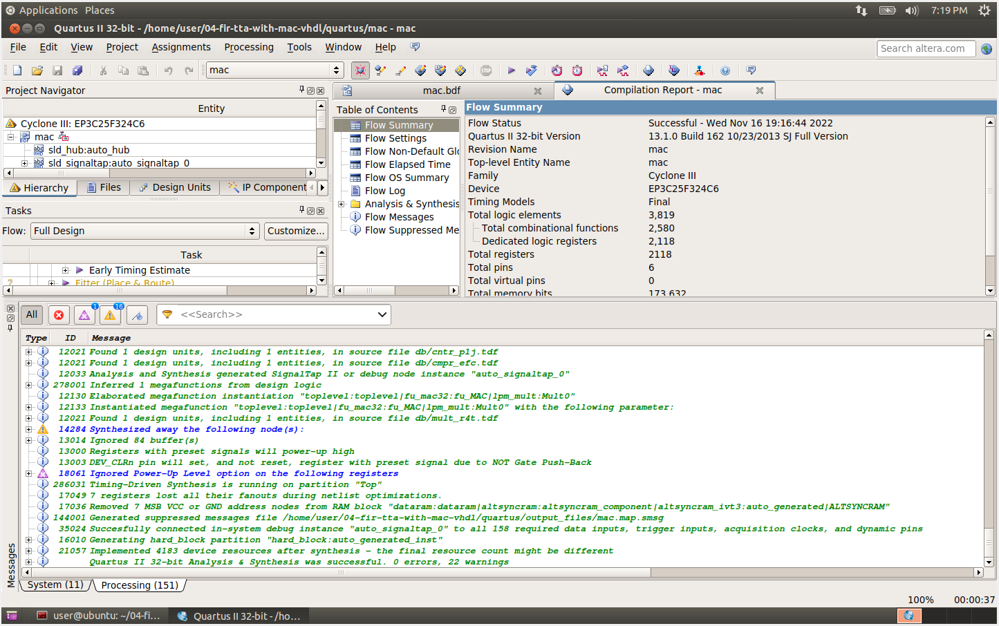

# Implementing custom MAC with VHDL

[VHDL implementation of MAC32 and SET_ACC](mac.vhdl).

The VHDL implementation is quite simple, it just loads the two inputs and increments the internal register with the product of the two inputs, or resets the internal register to given value when opcode is set to do "set_acc" operation instead of MAC.

Binary encoding map `processor.bem` for the processor can be generated by running:
```console
$ createbem processor.adf
```

After configuring the implementations for each FU in the processor, the processor can be generated:
```console
$ generateprocessor -v -t -b processor.bem -e toplevel -l 'vhdl' -i fir-tta-with-mac.idf -o hdl_files processor.adf
```

Processor generator output can be found [here](hdl_files/).

Quartus project can be found [here](quartus/).

The final board design looks like this:


Analysis and synthesis was successful:

